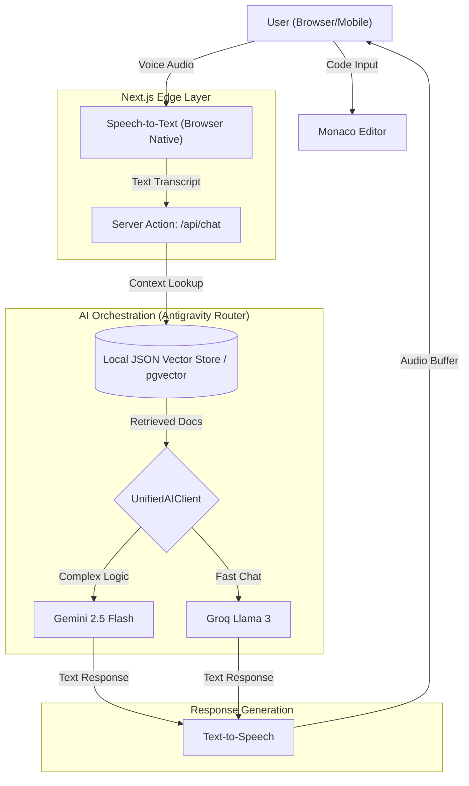
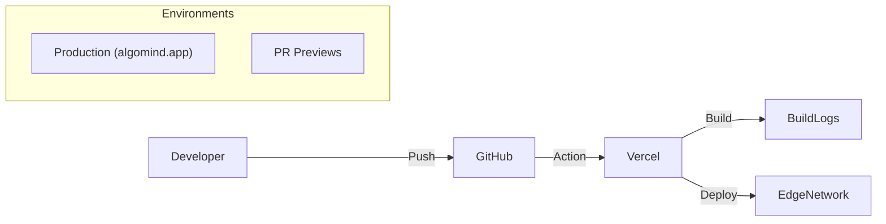

# DESIGN.MD

## 1. System Overview

**Design Philosophy:**  
AlgoMind follows a **"Voice-First, Latency-Critical"** design philosophy. Since the core value proposition is simulating a *real* human interview, latency is the enemy. The architecture prioritizes edge computing and fast inference models (Groq) to keep voice-to-voice latency under 1 second, creating a seamless conversational loop.

**Technology Choices:**  
*   **Next.js 14:** For server-side rendering and unified backend/frontend logic via Server Actions.  
*   **Groq:** Chosen for its lightning-fast inference speed (~300 tokens/sec), essential for real-time conversation.  
*   **Gemini 2.5 Flash / 2.0 Flash:** Used for deep reasoning and code analysis where accuracy trumps speed.  
*   **Supabase:** Provides an all-in-one backend (Auth, DB, Vector Store) to speed up development.

## 2. Architecture Design

### System Architecture Layout



### Layer Descriptions

*   **Frontend (User Interface Layer):**  
    *   **Technology:** Next.js 14 (React), Tailwind CSS, Framer Motion.  
    *   **Why:** React offers the best component ecosystem (Monaco Editor for code). shadcn/ui ensures accessibility and responsive design for mobile users in Tier 2/3 cities.  

*   **Application Layer:**  
    *   **Technology:** Next.js Server Actions.  
    *   **Why:** Simplifies the stack by keeping backend logic close to frontend components. Allows for easy type safety (TypeScript) across the boundary.

*   **AI/ML Layer:**  
    *   **Components:** `UnifiedAIClient` with `IntelligentRateLimiter` (Custom logic).
    *   **Models:** Gemini 2.5 Flash (Google) for deep analysis; Llama 3 (via Groq) for instant chat.
    *   **Why:** Hybrid approach balances cost, speed, and intelligence.

*   **Data Layer:**  
    *   **Technology:** Supabase (PostgreSQL).  
    *   **Structure:** Relational tables for Users, Interviews; **Hybrid RAG:** Local `embeddings.json` (MVP speed) + pgvector schema (Production scale).

## 3. Technology Stack

### Frontend:
*   **Framework:** Next.js 14 (App Router)
*   **UI Library:** shadcn/ui + Radix UI
*   **Language Support:** TypeScript
*   **State Management:** Zustand (for managing voice state)

### Backend:
*   **Environment:** Node.js (Vercel Serverless Functions)
*   **Framework:** Next.js API Routes / Server Actions
*   **ORM:** Drizzle ORM (or direct SQL via Supabase client)

### AI/ML:
*   **Models:**  
    *   *Reasoning:* Google Gemini 2.5 Flash  
    *   *Conversational:* Llama 3.3 70B (Groq)  
    *   *Embeddings:* Gemini Embedding 001
*   **Frameworks:** Vercel AI SDK (integrated)

### Database:
*   **Type:** PostgreSQL (Supabase)
*   **Vector Extension:** pgvector (Schema supported), Local JSON Vector Store (Active Implementation).
*   **Caching:** Next.js Data Cache / Vercel KV

### DevOps:
*   **Hosting:** Vercel (Optimized for Next.js)
*   **CI/CD:** GitHub Actions -> Vercel Deployment
*   **Monitoring:** Vercel Analytics / Speed Speed Insights

### Third-Party Services:
*   **Voice:** Web Speech API (STT), Edge TTS / ElevenLabs (TTS support planned)
*   **Auth:** Supabase Auth (Google/GitHub adapters)

## 4. Component Design

### 1. Unified AI Client (Antigravity Logic)
*   **Purpose:** Decides which AI model to call based on rate limits and tier availability.
*   **Inputs:** User query string, Conversation history.
*   **Processing:**
    *   `IntelligentRateLimiter` checks quota.
    *   Falls back from Gemini -> Groq (or vice-versa) on failure.
    *   Fetches relevant coding problem context via `SimpleVectorStore` (JSON).
        *   **Note:** JSON-based store used for MVP speed (no DB queries). 
        *   Schema supports pgvector migration for production scale.
*   **Outputs:** Streamed text response.

### 2. Voice Manager Hook
*   **Purpose:** Manages the browser's microphone stream and silence detection.
*   **Inputs:** Microphone audio stream.
*   **Processing:** Uses VAD (Voice Activity Detection) to determine when the user stops speaking.
*   **Outputs:** Text transcript sent to server.

### 3. Interview Session Store (Database)
*   **Purpose:** Persists interview state.
*   **Structure:** Stores chat logs, code snapshots, and final assessment scores.

## 5. Data Flow Diagram (Voice Loop)

1.  **User Speaks:** "How do I optimize this loop?" (Hindi/English).  
2.  **Browser STT:** Converts audio to text locally (Latency: ~0ms).  
3.  **Server Action:** Receives text + current code snapshot.
4.  **RAG Lookup:** System searches `embeddings.json` (SimpleVectorStore) for similar optimization techniques.
5.  **Router:** Selects *Groq Llama 3* (via UnifiedAIClient) for a fast response.  
6.  **Generation:** AI generates: "You can use a hash map to reduce complexity to O(n)."  
7.  **TTS & UI:** Text is displayed and spoken back to the user simultaneously.

## 6. AI/ML Design

**Model Selection:**  
*   **Primary (Chat):** Llama 3.3 70B on Groq.  
    *   *Why:* Unbeatable speed (time-to-first-token < 200ms). Critical for voice.
*   **Primary (Analysis):** Gemini 2.5 Flash.  
    *   *Why:* Massive context window (1M+ tokens) allows it to read the entire conversation history and code state for the final report.

**Prompt Engineering:**  
*   **System Prompts:** "You are an empathetic but rigorous technical interviewer. Do not give the answer immediately. Ask guiding questions."
*   **Context:** Injected with the specific LeetCode problem description and test cases.

## 7. Database Schema

**Tables:**

*   **users**
    *   `id` (UUID, PK)
    *   `email` (Text)
    *   `full_name` (Text)
    *   `preferences` (JSONB - language, difficulty)

*   **interviews**
    *   `id` (UUID, PK)
    *   `user_id` (FK -> users.id)
    *   `problem_slug` (Text)
    *   `status` (Enum: 'in_progress', 'completed')
    *   `transcript` (JSONB)
    *   `score_breakdown` (JSONB - 8-dim scores)
    *   `created_at` (Timestamp)

*   **problems** (Static Data)
    *   `slug` (PK)
    *   `title` (Text)
    *   `description` (Text)
    *   `difficulty` (Enum)
    *   `starter_code` (JSONB)

## 8. API Design

### Endpoints:
*   **POST /api/chat/route** (Core Interaction Loop)
    *   *Input:* `messages` (Chat History), `problemContext` (Title, Content), `systemPrompt` (Instructions)
    *   *Output:* Streamed text response from AI/Groq.
    *   *Logic:* Performs RAG lookup -> Calls Antigravity Router -> Generates Response.
*   **GET /api/tts** (Mock/Future)
    *   *Input:* Text to speak.
    *   *Output:* Audio buffer (MP3/WAV).
*   **POST /api/generate-report** (Assessment)
    *   *Input:* Completed interview transcript.
    *   *Output:* JSON object with scores for 8 dimensions.

### 8.5 Server Actions & API Routes

**1. POST /api/chat** (Standard Route)
- Core chat loop handling streaming responses.

**2. Server Action: `saveInterviewSession`**
- **File:** `src/app/actions/save-session.ts`
- **Purpose:** Persists interview transcript and results to Supabase `interview_sessions` table.
- **Input:** `userId`, `problemId`, `transcript`, `result` (Assessment).

**3. POST /api/auth/signup** (Supabase Auth handled client-side/middleware)

**4. Server Action: `startInterview` (Planned)**
- Initializes session state.

**Error Handling:**
- **429:** Rate limit exceeded (Managed by Vercel KV).
- **500:** AI provider failure (Router attempts fallback).
- **401:** Unauthorized access to interview session.

## 9. UI/UX Design

**Principles:**  
*   **"Zen Mode":** During the interview, hide all distractions (navbars, footers). Only Code + Chat.  
*   **Mobile-First:** Code editor collapses to a read-only view on mobile, focusing on the voice conversation functionality for reviewing concepts on the go.

### Wireframe Details:

**Interview Room Screen (Desktop 1920x1080):**
```
┌────────────────────────────────────────────────────────────────┐
│  🧠 AlgoMind     [⏱️ 12:34 / 30:00]    [Hints: 2/5]  [End 🚪]   │
├──────────────────────────┬─────────────────────────────────────┤
│                          │  💬 Conversation Feed               │
│   MONACO EDITOR          │  ─────────────────────────────────  │
│                          │                                     │
│   1  def two_sum():      │  🤖 AI (0:02):                      │
│   2    # Your code here  │  "Let's start! What's your          │
│   3                      │   initial approach?"                │
│   4                      │                                     │
│   5                      │  🎤 YOU (0:15):                     │
│                          │  "I'll use a brute force with       │
│                          │   nested loops..."                  │
│                          │  [🔊 Voice Waveform Animation]     │
│  [Theme: Dark ▼]         │                                     │
│  [Language: Python ▼]    │  🤖 AI (0:18):                      │
│                          │  "Good! What's the complexity?"     │
│  Console Output:         │                                     │
│  > Test Case 1: ✅       │  ─────────────────────────────────  │
│  > Test Case 2: ✅       │  [💡 Request Hint]  [❓ Ask AI]    │
│                          │  [🎤 Hold to Speak - Space Bar]    │
│  [▶️ Run Code]           │                                     │
└──────────────────────────┴─────────────────────────────────────┘
```
*60% width*                         *40% width*

**Mobile View (390x844 - iPhone 14):**
```
┌──────────────────────────┐
│ 🧠 AlgoMind    ⏱️ 12:34  │ ← Sticky Header
├──────────────────────────┤
│                          │
│  💬 Conversation         │
│  ───────────────         │
│  🤖: "What's your        │
│       approach?"         │
│                          │
│  🎤 YOU:                 │
│  "I'll use a hash map"   │
│  [Waveform ▁▂▃▄▅]       │
│                          │
│  🤖: "Great! Code it"    │
│                          │
│  ───────────────         │
│  [🎤 Tap to Speak]      │ ← Floating Action Button
├──────────────────────────┤
│  📝 Code (Read-only)     │ ← Collapsible Drawer
│  Swipe up to edit ⬆️      │
└──────────────────────────┘
```

**Report Card Screen:**
```
┌────────────────────────────────────┐
│  Your Interview Report             │
│  Problem: Two Sum | Duration: 15m  │
├────────────────────────────────────┤
│                                    │
│     [Radar Chart - 8 Dimensions]   │
│           10                       │
│          /  \                      │
│       8 /____\ 9    Communication  │
│        |      |     Efficiency     │
│        |      |     Code Quality   │
│       7\______/10   (etc.)         │
│                                    │
│  Overall Score: 82/100 🎯          │
│                                    │
│  💪 Strengths:                     │
│  • Optimized from O(n²) to O(n)    │
│  • Explained thought process       │
│                                    │
│  📈 Areas to Improve:              │
│  • Reduce filler words (12 "umm"s) │
│  • Practice edge case reasoning    │
│                                    │
│  [📥 Download PDF] [🔄 Try Again]  │
└────────────────────────────────────┘
```

## 10. Localization Strategy

*   **Translations:** UI labels storage in `en.json` / `hi.json` (i18n).  
*   **Voice:** Browser STT automatically detects the spoken language (English/Hindi).  
*   **Content:** Problem descriptions are currently English-only (standard for coding), but *hints* can be requested in Hindi in Phase 2.

## 11. Security Design

*   **RLS (Row Level Security):** Supabase policies ensure users can only read/write their own interview data.  
*   **API Protection:** Rate limiting via Vercel KV to prevent abuse of AI endpoints.  
*   **Sanitization:** All user code is treated as untrusted; executed in a sandboxed browser environment, not on the server.

## 12. Scalability & Performance

*   **Serverless:** No efficient servers to manage. Vercel scales lambda functions automatically.  
*   **Database:** Supabase manages connection pooling (PgBouncer) for high concurrency.  
*   **Global Edge:** Vercel Edge Network caches static assets close to users in India (Mumbai/Bangalore regions).

## 12.5 Cost Optimization Strategy

**Cost Breakdown (Per Interview):**
*   **AI Inference:**
    *   **Groq (Llama 3):** Free in beta (Primary Chat).
    *   **Gemini 2.5 Flash:** ~$0.002 per interview (Analysis only).
*   **Database:** Supabase Free Tier (500MB). Audio not stored, only transcripts (text).
*   **Hosting:** Vercel Hobby (Free).
*   **Total Cost:** **< ₹0.20 ($0.0025) per interview session.**

**Optimization Tactics:**
*   Aggressive use of Groq for all "chatty" interactions (hints, intros).
*   Lazy-loading the Monaco Editor to reduce initial JS bundle size.
*   Caching static problem data on Edge.

## 13. Deployment Architecture



### 13.5 Disaster Recovery & Backup
*   **Database:** Automatic daily backups via Supabase (7-day retention).
*   **Code:** Git version control (GitHub).
*   **Rollback:** Instant rollback via Vercel dashboard.
*   **High Availability:** Multi-region deployment via Vercel Edge.

## 14. Monitoring & Logging

*   **Logs:** Vercel Runtime Logs for API errors.  
*   **Analytics:** PostHog for tracking user engagement (Time in interview, Drop-off rate).  
*   **Errors:** Sentry for frontend crash reporting.

## 15. Future Enhancements (Phase 2)

*   **Peer Mock Interviews:** Connect two students to interview each other, guided by AI.  
*   **Local Language Content:** Code explanations in Tamil/Telugu/Hindi.  
*   **Resume Scanner:** Auto-suggest problems based on resume gaps.

## 16. Demo Assets for Judges

**GitHub Repo:** `github.com/yourusername/algomind`  
**Live Demo:** `algomind.vercel.app`  
**Demo Credentials:**  
*   **Email:** `demo@algomind.app`  
*   **Password:** `Demo@2024`

**Sample Interview Walkthrough:**
1.  **Login** and click **"Start Interview"**.
2.  Select **"Two Sum"**.
3.  **Speak:** "I think I will use a brute force approach first."
4.  **AI Interrupts:** "That works, but what is the time complexity?"
5.  **Code:** Type a basic loop in Python.
6.  **Ask for Help:** "I am stuck on optimization."
7.  **AI Hint:** "Consider using a hash map for O(1) lookups."
8.  **Complete** and view the **Radar Chart Report**.

**Known Limitations:**
*   Voice WebRTC issues on some Safari versions (use Chrome).
*   Mock data used for "Trend Analysis" in demo mode.
*   Currently supports English audio input only (Hinglish in beta).
